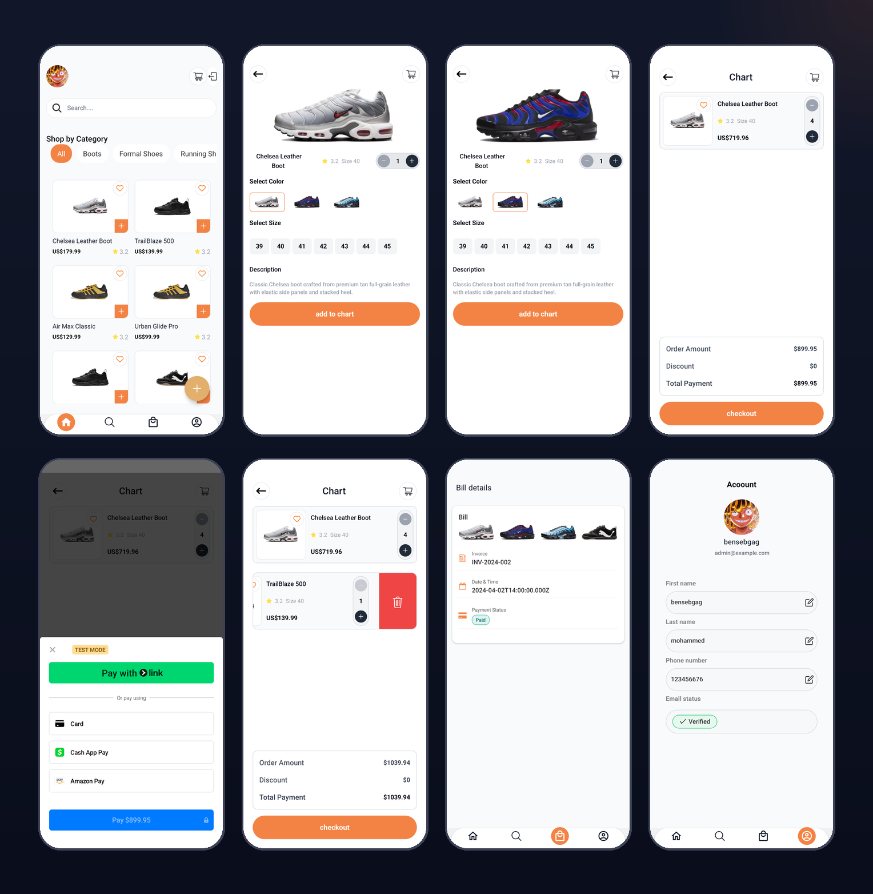

# 📱 E-Commerce Mobile App

A cross-platform mobile e-commerce application built with **React Native** and **Expo**. Features product browsing, shopping cart, Stripe payments, Clerk authentication, and order management.

---

## 🚀 Tech Stack

| Layer         | Technology                             |
| ------------- | -------------------------------------- |
| Framework     | React Native + Expo (SDK 53)           |
| Language      | TypeScript                             |
| Navigation    | Expo Router (file-based)               |
| Auth          | Clerk (`@clerk/clerk-expo`)            |
| Payments      | Stripe (`@stripe/stripe-react-native`) |
| Data Fetching | TanStack React Query                   |
| HTTP Client   | Axios                                  |
| Styling       | NativeWind (Tailwind for React Native) |
| Animations    | Lottie React Native                    |
| Maps          | React Native Maps                      |

---

## 📁 Project Structure

```
ecommerce/
├── app/
│   ├── _layout.tsx          # Root layout (Clerk + navigation setup)
│   ├── index.tsx            # Entry / splash screen
│   ├── auth/
│   │   ├── Login.tsx        # Login screen
│   │   ├── SignUp.tsx       # Registration screen
│   │   └── useUser.ts       # Auth hook
│   ├── (tabs)/
│   │   ├── _layout.tsx      # Tab bar layout
│   │   ├── index.tsx        # Home screen
│   │   ├── shope.tsx        # Shop / product listing
│   │   ├── search.tsx       # Search screen
│   │   └── profile.tsx      # User profile
│   ├── chart/
│   │   ├── index.tsx        # Cart screen
│   │   ├── [id].tsx         # Cart item detail
│   │   └── chatChekout.tsx  # Checkout screen
│   └── EditProfile/
│       └── index.tsx        # Edit profile screen
├── components/
│   ├── AnimatedForm.tsx     # Animated input form
│   ├── Button.tsx           # Reusable button
│   ├── InputField.tsx       # Styled input field
│   ├── SearchBar.tsx        # Search input
│   ├── ProductItemChart.tsx # Cart product card
│   ├── DisplayInRows.tsx    # Grid/row product display
│   ├── VerificationModal.tsx# Email verification modal
│   ├── Map.tsx              # Map component
│   ├── OAuth.tsx            # Google OAuth button
│   ├── Spinner.tsx          # Loading indicator
│   ├── UserInfo.tsx         # User info display
│   └── EditFiled.tsx        # Editable field component
├── features/
│   ├── products/            # Product list & detail hooks
│   ├── categories/          # Category filter components
│   ├── chart/               # Cart state & sync hooks
│   ├── bill/                # Order creation hook
│   ├── payment/             # Stripe payment hooks & UI
│   └── sizesShoes/          # Size selector component
├── services/
│   ├── apiProducts.ts       # Products API calls
│   ├── apiCategory.ts       # Categories API calls
│   ├── apiBill.ts           # Orders API calls
│   ├── apiChart.ts          # Cart API calls
│   ├── apiUser.ts           # User API calls
│   └── strip.ts             # Stripe integration
├── api/
│   └── axios.ts             # Axios instance with base URL & interceptors
├── Util/
│   ├── type.ts              # Global TypeScript types
│   └── Colors.ts            # Color constants
├── hooks/
│   └── useLogout.ts         # Logout hook
├── assets/
│   ├── images/              # App images
│   └── fonts/               # Custom fonts
├── app.json                 # Expo config
└── tailwind.config.js       # NativeWind config
```

---

## ✅ Features

### Done

- [x] User authentication (Sign Up, Login, Logout) with Clerk
- [x] Google OAuth login
- [x] Email verification flow
- [x] Product listing and browsing
- [x] Product detail with size and color selection
- [x] Category filtering
- [x] Search screen
- [x] Shopping cart (add, update quantity, remove)
- [x] Cart sync with backend
- [x] Stripe payment integration
- [x] Order / bill creation
- [x] User profile screen
- [x] Edit profile
- [x] Lottie animations
- [x] Tab-based navigation

### 🚧 In Progress / Planned

- [ ] Product reviews and ratings
- [ ] Order history screen
- [ ] Push notifications
- [ ] Wishlist / favorites
- [ ] Admin panel screens
- [ ] Dark mode support
- [ ] Better error handling UI

---

## ⚙️ Getting Started

### Prerequisites

- Node.js >= 18
- [Expo CLI](https://docs.expo.dev/get-started/installation/)
- Expo Go app on your phone, or an Android/iOS simulator
- Clerk account → [clerk.com](https://clerk.com)
- Stripe account → [stripe.com](https://stripe.com)
- The [backend API](../backend-ecommerce/) running locally or deployed

### Installation

```bash
# Clone the repository
git clone https://github.com/bensebgag/ecommerce-mobile.git
cd ecommerce

# Install dependencies
pnpm install
# or
npm install
```

### Environment Variables

Create a `.env` file in the root:

```env
EXPO_PUBLIC_API_URL=http://YOUR_LOCAL_IP:3000/api/v1
EXPO_PUBLIC_CLERK_PUBLISHABLE_KEY=your_clerk_publishable_key
EXPO_PUBLIC_STRIPE_PUBLISHABLE_KEY=your_stripe_publishable_key
```

> ⚠️ Use your machine's **local IP address** (e.g. `192.168.x.x`), not `localhost`, so your phone can reach the backend.

### Running the App

```bash
# Start Expo dev server
pnpm start
# or
npx expo start
```

Then:

- Press `a` to open on Android emulator
- Press `i` to open on iOS simulator
- Scan the QR code with **Expo Go** on your phone

---

## 🔐 Authentication Flow

1. User signs up or logs in via Clerk
2. Clerk issues a JWT token stored securely with `expo-secure-store`
3. Axios interceptor attaches the token to every API request
4. Backend verifies the token using Clerk's JWKS endpoint

---

## 💳 Payment Flow

1. User proceeds to checkout from cart
2. App calls backend to create a Stripe PaymentIntent
3. Stripe sheet opens for card entry
4. On success, a Bill record is created in the database

---

## 🖼️ Screenshots

<div align="center">

|                                                  |     |     |
| :----------------------------------------------: | :-: | :-: |
|  |     |

</div>

---

## 👤 Author

**Bensebgag Mohammed Amine**

- GitHub: [@bensebgag](https://github.com/bensebgag)
- LinkedIn: [linkedin.com/in/bensebgag-mohammed-96955625b](https://www.linkedin.com/in/bensebgag-mohammed-96955625b/)
- Email: bensebgagmohammed@gmail.com
